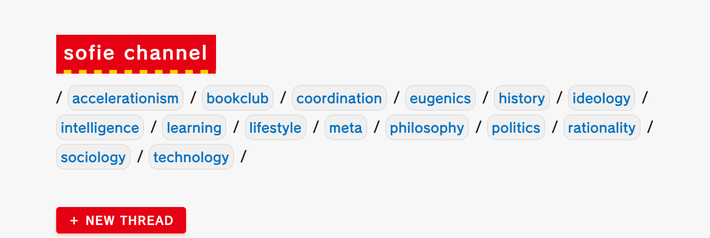
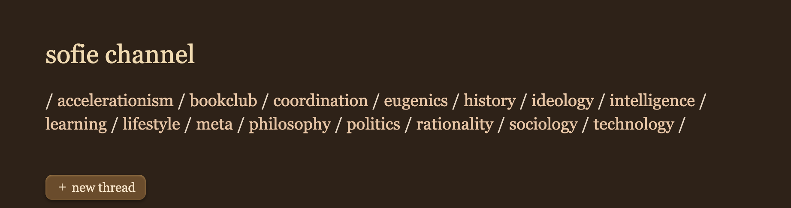

# Sofiechan Custom Styles

This repository contains custom CSS styles for [sofiechan.com](https://sofiechan.com) that can be applied using the Stylus browser extension.

> **Note:** Like and mute buttons currently do not change color when activated.

## Styles Included

1. **Japanese Train Station Theme** - A light, clean design inspired by Japanese rail transit signage with distinctive colors from various Tokyo train lines.

2. **Skeuomorphic Dark Theme** - A rich dark theme with textured elements, beveled edges, and a warm color palette reminiscent of wooden textures.

## Installation

### Step 1: Install Stylus

Install the Stylus extension for your browser:
- [Chrome/Edge/Brave](https://chromewebstore.google.com/detail/stylus/clngdbkpkpeebahjckkjfobafhncgmne)
- [Firefox](https://addons.mozilla.org/en-US/firefox/addon/styl-us/)

### Step 2: Add a Style

1. Click on the Stylus icon in your browser toolbar
2. Select "Create new style" 
3. Give your style a name (e.g., "Sofiechan Train Station Theme")
4. Copy and paste the CSS content from one of the .css files in this repository
5. In the "Applies to" section, select "URLs on the domain" and enter: `sofiechan.com`
7. Click "Save"

## Previews

### Japanese Train Station Theme

*A clean, light interface inspired by Japanese rail signage with distinctive line colors*

### Skeuomorphic Dark Theme

*A rich, textured dark theme with wooden accents and beveled elements*

## Customization

Feel free to modify these styles to suit your preferences:

- Change the colors by editing the CSS variables in the `:root` section
- Adjust font sizes or families
- Modify border radius or shadow values

## Troubleshooting

- If styles aren't applying correctly, make sure the domain is set correctly in Stylus
- Try refreshing the page or clearing your browser cache
- Check the Stylus extension options to ensure it's enabled for the site

## License

These styles are released under MIT License. Feel free to use, modify, and share.

## Contributing

Contributions welcome! Feel free to submit pull requests with improvements or new themes.
